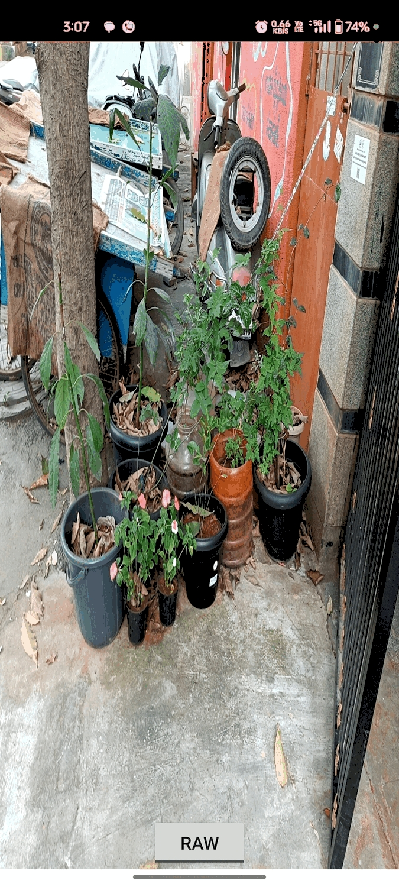

# EdgeView: Real-time Camera, OpenCV, and OpenGL on Android

EdgeView is an advanced Android project demonstrating a real-time computer vision pipeline. It captures a live camera feed, processes it in C++ using OpenCV, and renders the output efficiently to the screen with OpenGL ES. The project also includes a simple TypeScript web-based viewer to display a sample processed frame.

## Overview

The core functionality of EdgeView is to create a seamless pipeline from the device's camera to a hardware-accelerated OpenGL surface.

- **Camera Input**: The app uses **CameraX** to access the camera and receive frames for analysis.
- **JNI Processing**: Each camera frame is passed from Java/Kotlin to a C++ layer through the **Java Native Interface (JNI)**.
- **OpenCV Engine**: In C++, the powerful **OpenCV** library performs real-time image processing, such as grayscale conversion and Canny edge detection.
- **OpenGL ES Rendering**: The processed frame is returned to the Java layer and uploaded to the GPU as a texture, which is then rendered onto a `GLSurfaceView` for a smooth, hardware-accelerated display.
- **Web Viewer**: A separate `web/` directory contains a **TypeScript** application that displays a sample output image, demonstrating how the processed data could be consumed by a web frontend.

This project serves as a template for building high-performance computer vision and augmented reality applications on Android.


## Features Implemented

- **Live Camera Feed**: Utilizes Android's modern `CameraX` library for efficient and easy-to-manage camera operations.
- **High-Performance JNI Bridge**: Optimized JNI layer for passing camera frames between Java and C++ with minimal overhead.
- **Real-time OpenCV Processing**: Implements grayscale and Canny edge detection filters in C++ for high-speed frame analysis.
- **Hardware-Accelerated Rendering**: Renders the final output using **OpenGL ES 2.0**, ensuring a smooth preview without taxing the CPU.
- **Dynamic View Toggle**: A simple UI button allows the user to switch between the raw camera feed and the OpenCV-processed feed in real-time.
- **Screen Rotation Handling**: The OpenGL renderer correctly handles device orientation changes, ensuring the camera preview is always displayed upright.
- **TypeScript Web Viewer**: A simple, standalone web component built with TypeScript to display a sample processed image.


## Project Structure

```
EdgeView/
├── app/
│   ├── src/main/
│   │   ├── java/com/example/edgeview/  # Main Android application logic
│   │   │   ├── MainActivity.java       # Main activity, CameraX setup, UI
│   │   │   ├── CameraFrameProvider.java  # Handles ImageAnalysis and JNI bridge
│   │   │   └── gl/
│   │   │       └── GLRenderer.java       # OpenGL ES renderer and shaders
│   │   ├── cpp/                        # Native C++ source code
│   │   │   ├── CMakeLists.txt          # Build script for the native library
│   │   │   ├── process.cpp             # Core OpenCV image processing
│   │   │   └── ...                     # Other native source files
│   └── build.gradle                    # App-level Gradle build script
├── web/
│   ├── src/                          # TypeScript source for the web viewer
│   ├── index.html                    # HTML for the web viewer
│   └── tsconfig.json                 # TypeScript compiler configuration
└── ...
```

- **`app/java`**: Contains all the Android Java source code, including the `MainActivity`, `CameraX` setup, and the `GLRenderer`.
- **`app/cpp`**: Holds the native C++ code responsible for JNI bindings and image processing with OpenCV.
- **`app/gl`**: Contains the OpenGL ES renderer class, including the vertex and fragment shaders for texture rendering and rotation.
- **`web`**: A standalone module for the TypeScript-based web viewer.

## Architecture Explanation

The application follows a clean, sequential pipeline for processing and rendering frames.

1.  **Camera to Analyzer**: `CameraX` is configured with an `ImageAnalysis` use case. The analyzer receives frames as `ImageProxy` objects on a background thread.
2.  **Java to C++ (JNI)**: The `CameraFrameProvider` converts each `ImageProxy` into an NV21 byte array. This byte array, along with image dimensions and rotation, is passed to a native C++ function via a JNI call in `MainActivity`.
3.  **OpenCV Processing**: The native C++ function receives the NV21 data, converts it to an OpenCV `Mat`, performs processing (e.g., Canny edge detection), and converts the final processed `Mat` into an RGBA byte array.
4.  **C++ to Java and OpenGL**: The RGBA byte array is returned to Java. It is then passed to the `GLRenderer` and uploaded to the GPU as a texture. A vertex shader applies the correct rotation to the texture coordinates, and a fragment shader draws the texture to a fullscreen quad.
5.  **TypeScript Viewer**: The `web` component is a separate static site. It loads a pre-saved, processed image and uses a simple TypeScript script to manage basic UI interactions, demonstrating a potential client for vision-based data.

## Setup Instructions

Follow these steps to set up the project on your local machine.

1.  **Android Studio**:
    - Use Android Studio Hedgehog (2023.1.1) or newer.

2.  **NDK (Native Development Kit)**:
    - The project is configured to use NDK version `23.1.7779620`.
    - You can install this via the Android Studio SDK Manager: `Tools > SDK Manager > SDK Tools > NDK (Side by side)`. Ensure that version `23.1.7779620` is checked and installed.

3.  **OpenCV Android SDK**:
    - This project uses a Gradle dependency for OpenCV, so no manual download is required. The dependency `com.github.quickbirdstudios:opencv-android:4.6.0` will be fetched automatically by Gradle.

4.  **CMake Build**:
    - The native C++ code is built using CMake. The project uses `prefab` to automatically find and link the OpenCV library from the Gradle dependency. Android Studio will handle this when you sync the Gradle project.

5.  **Web Viewer Setup**:
    - Navigate to the `web/` directory in your terminal.
    - Install dependencies: `npm install`
    - Compile the TypeScript code: `npm run build` (or `tsc`).

## Build & Run

### Android App
1.  Open the project in Android Studio.
2.  Sync the project with Gradle files.
3.  Connect a physical Android device.
4.  Click the "Run" button in the toolbar or use the command line: `./gradlew installDebug`.
5.  When the app launches, grant the **CAMERA** permission when prompted.
6.  Use the on-screen toggle to switch between the raw and processed camera feeds.

### Web Viewer
1.  Ensure you have completed the web viewer setup steps above.
2.  Serve the `web/` directory using a local web server. For example, using Python:
    ```bash
    cd web/
    python -m http.server
    ```
3.  Open a browser and navigate to `http://localhost:8000`.

## Screenshots / GIF

*(Placeholders for your media)*

|         Raw Camera Feed         |          Processed (Canny)           |
|:-------------------------------:|:------------------------------------:|
|  |  |

## Known Issues

- The app is currently configured to use only the rear-facing camera.
- The web viewer is not connected to the live camera feed; it displays a static, pre-processed sample image.
- Performance of the C++ processing may vary depending on the device's hardware capabilities.

## Future Improvements

- **Live Web Streaming**: Use WebSockets to stream the processed frames from the Android app to the web viewer in real-time.
- **Advanced Shaders**: Implement more complex GLSL shaders for advanced visual effects, such as distortion, color grading, or custom filters.
- **More OpenCV Filters**: Add UI controls to switch between different OpenCV filters (e.g., Sobel, blur, feature detection).
- **Front Camera Support**: Add functionality to switch between the front and rear cameras.
- **Performance Optimizations**: Explore GPU-based image processing with OpenGL shaders or Vulkan compute to offload work from the CPU.

